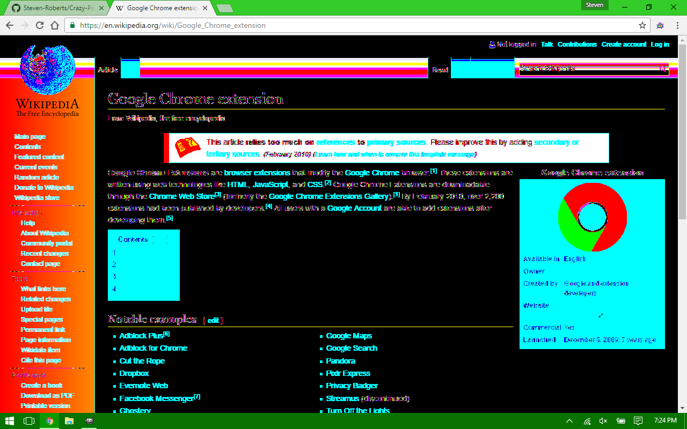
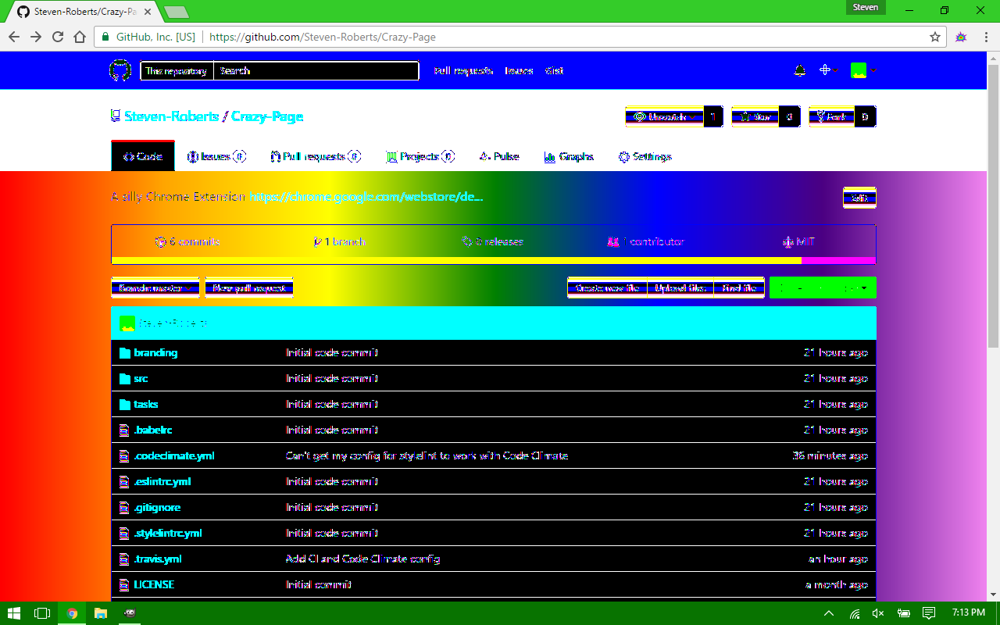

# Crazy Page

Are you tired of webpages being boring?  Well you need Crazy Page!  You can turn
any webpage into a crazy, rainbow-colored, animated webpage with the click of a
button (or by pressing Alt-C).  It is great for pranks or just wasting time.

You can install this Chrome Extension [here](https://chrome.google.com/webstore/detail/kfieapkahkkhclonobinbonddbfkpbck).

## Screenshots

